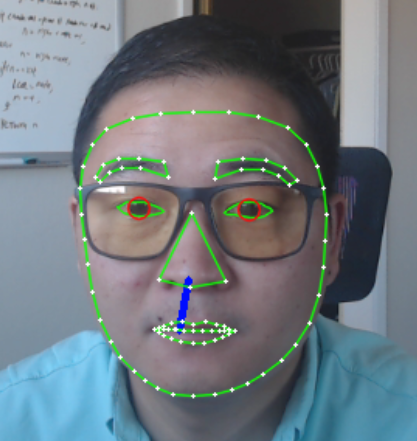

# Driver attention monitor system
With the advance of L2+ automated driving, more and more drivers pay 
less attention to the road while driving, which poses a great risk to the road safety, and so does drowsiness.  In order to combat this problem, I developed this prototype for monitoring the driver's attention, issuing an audio alarm when necessary and saving the video periodically. 

## Overview 
###Sensor:
 A single web camera 

###Backbone
[Mediapipe](https://google.github.io/mediapipe/) (deep learning tool developed by Google,
Apache-2.0 license), predicts a face mesh made up of a list of 468 points. With the known indices of eyebrow, eye, iris, noise and face edge, one can easily connect them and use relevant method to monitor them.

  
###speed
30FPS and higher 

## Features
### Already implemented 
- Iris visibility 
- Eye blink frequency 
- Eye Aspect Ration (EAR, similar to ECG)
- Face orientation 
- Yawn 

### To be implemented
- EAR pulse pattern analysis 
- Head movement track and analysis 
- voice recorder  
- automatic parameter tuning 

## Data storage 
Saved data
- video clips (periodically saved in case of crash)
- Audio 
- Analysis results 
  - EAR
  - MAR
  - Face orientation
  - Warnings 
  
## Hyperparameters tuning 
There are many hyperparameters needing fine tuning to work for every person. One way to make this system self-adpating is to assume that the driver is sober at the beginning of driving,
and use these images to tune the relevant parameters. 

## Potential Issues
Due to light condition,or wearing a sunglass, eyes may not be detected properly, which likely fail the drowsiness detection. One of the remedy is to track head micro-movement.

## Demo

## Acknowledgement 
This implementation of driver attention monitor system was deeply inspired by [Asadullah Dal](https://github.com/Asadullah-Dal17/iris-Segmentation-mediapipe-python) for Iris visbility calculation and [Nicolai Nielsen](https://www.youtube.com/watch?v=-toNMaS4SeQ) for face pose estimation.
